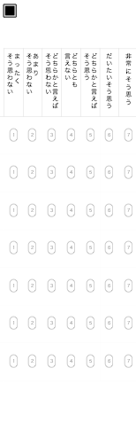

# 1. マークシートとマーカーを設定する
## マークシートからマーカーを作成する
まず大元のマークシートとマーカーを設定します。ここで重要なのは、Qiitaの投稿にもありますがマーカーのサイズをマークシートのものとある程度合わせておくことです。そうしないと、後のフローで読み取れなくなってしまうという問題点があります。これを解消するための、マークシートと画像の解像度などから調整する方法が元記事には載っています。

ただ僕の環境では上手くいきませんでした。しかし、マークシート中のマーカーのサイズを一致させるのであれば、解像度を実際の読み込みと揃えた環境でスキャンをして、そこからトリミングをしてマーカーを切り取るのが一番良いのではないか？と気づき、やってみたら上手くいきました。

https://camo.qiitausercontent.com/7796ca69b277a6c238674fc0276016eb542816f5/68747470733a2f2f71696974612d696d6167652d73746f72652e73332e616d617a6f6e6177732e636f6d2f302f3130363331372f34333237333130352d626562662d306237632d346336352d3966336565306636633439662e706e67

このマークシートをローカルに保存します。ここではPNGというディレクトリを作り、`PNG/Marksheet.png`としておきます。これをMacのプレビューで開いて、マーカー1つの部分だけをトリミングして別の`png`ファイルに保存し、`PNG/Marker.png`と名前をつけておきます。これで準備完了です。

またファイルを読み込むときに相対パスを使うときは、現在のディレクトリに気をつけてください。Pythonでディレクトリを確認するやり方は、
```
import os
os.getcwd() 
```
となるようです。

## グレースケール ( mode = 0 ) でファイルを読み込む
```
import cv2
Marker = cv2.imread('PNG/Marker.png', 0) # マーカー 
Marksheet = cv2.imread('PNG/Marksheet.png', 0) # マークシート
```

## cv2.imreadで取り込んだ画像ファイルの中身を確認してみる
```
>>> Marker
array([[255, 255, 255, 255, 255, 255, 255, 255, 255, 255, 255, 255, 255,
        255, 255, 255, 255, 255, 255, 255],
       [255, 255, 254, 127, 122, 122, 122, 122, 122, 122, 122, 122, 122,
        122, 122, 122, 121, 224, 255, 255],
       [255, 255, 140,  85, 132, 132, 132, 132, 132, 132, 132, 132, 132,
        132, 132, 132, 114,  62, 255, 255],
       [255, 255, 140, 114, 235, 174, 174, 174, 174, 174, 174, 174, 174,
        174, 174, 213, 185,  69, 255, 255],
       [255, 255, 140, 114, 191,   0,   0,   0,   0,   0,   0,   0,   0,
          0,   0, 121, 185,  69, 255, 255],
       [255, 255, 140, 114, 191,   0,   0,   0,   0,   0,   0,   0,   0,
          0,   0, 121, 185,  69, 255, 255],
       [255, 255, 140, 114, 191,   0,   0,   0,   0,   0,   0,   0,   0,
          0,   0, 121, 185,  69, 255, 255],
       [255, 255, 140, 114, 191,   0,   0,   0,   0,   0,   0,   0,   0,
          0,   0, 121, 185,  69, 255, 255],
       [255, 255, 140, 114, 191,   0,   0,   0,   0,   0,   0,   0,   0,
          0,   0, 121, 185,  69, 255, 255],
       [255, 255, 140, 114, 191,   0,   0,   0,   0,   0,   0,   0,   0,
          0,   0, 121, 185,  69, 255, 255],
       [255, 255, 140, 114, 191,   0,   0,   0,   0,   0,   0,   0,   0,
          0,   0, 121, 185,  69, 255, 255],
       [255, 255, 140, 114, 191,   0,   0,   0,   0,   0,   0,   0,   0,
          0,   0, 121, 185,  69, 255, 255],
       [255, 255, 140, 114, 191,   0,   0,   0,   0,   0,   0,   0,   0,
          0,   0, 121, 185,  69, 255, 255],
       [255, 255, 140, 114, 191,   0,   0,   0,   0,   0,   0,   0,   0,
          0,   0, 121, 185,  69, 255, 255],
       [255, 255, 140, 114, 226, 138, 138, 138, 138, 138, 138, 138, 138,
        138, 138, 194, 185,  69, 255, 255],
       [255, 255, 140,  93, 167, 167, 167, 167, 167, 167, 167, 167, 167,
        167, 167, 167, 149,  50, 255, 255],
       [255, 255, 238,  74,  87,  87,  87,  87,  87,  87,  87,  87,  87,
         87,  87,  87,  84, 189, 255, 255],
       [255, 255, 255, 255, 255, 255, 255, 255, 255, 255, 255, 255, 255,
        255, 255, 255, 255, 255, 255, 255]], dtype=uint8)
```

行列になってるんですね、面白い。これはNumPy配列、`ndarray`というそうです。今回はグレースケールで読み込んでいるので、行 ( 高さ ) x 列 ( 幅 ) の二次元の`ndarray`となっているようです。OpenCVに関してはこちらの記事が非常に参考になりました。

https://note.nkmk.me/python-opencv-imread-imwrite/

`ndarray`に関しては以下の関数で、オブジェクトの情報を抽出できるようです。Pythonって、`Marker.shape`みたいに`オブジェクト名`+`.`+`関数名`で定義できるんですね、面白い。

```
>>> print(type(Marker)) # オブジェクト型
<type 'numpy.ndarray'>

>>> print(Marker.shape) # サイズ
(18, 20)

print(Marker.dtype)
# uint8
```

`uint8`とはなにかわからなかったのですが、Yahoo知恵袋によると、
https://detail.chiebukuro.yahoo.co.jp/qa/question_detail/q11150842756

> データの形式を定めるものです。使用するコンパイラによって、定義の形は異なる場合があります。一般に
整数でも符号付と符号なしがあり、ｕは符号なしです。ｉｎｔは整数です。１６とか８はデータ長です。

ということで8バイトの符号なし整数ということのようです。

## 関数matchTemplate()を用いてマーカーを抽出する
```
Marker_Match = cv2.matchTemplate(Marksheet, Marker, cv2.TM_CCOEFF_NORMED)
```
マークシートからマーカーの部分を抽出します。`matchTemplate()`は、テンプレートマッチングの関数で、`cv2.TM_CCOEFF_NORMED`の部分は，類似を判定するための関数です。

http://labs.eecs.tottori-u.ac.jp/sd/Member/oyamada/OpenCV/html/py_tutorials/py_imgproc/py_template_matching/py_template_matching.html
> テンプレートマッチングは画像中に存在するテンプレート画像の位置を発見する方法です。OpenCvはcv2.matchTemplate() 関数を用意しています。この関数はテンプレート画像を入力画像全体にスライドさせ、テンプレート画像と画像の注目領域とを比較します。

というものでした。マーカーの検出だけじゃなくて、顔の検出などにも使えるんですね、面白い。`cv2.TM_CCOEFF_NORMED`の他にもいくつかアルゴリズムがあるようでした。

`Marker_Match`の中身を見てみると、

```
>>> Marker_Match
array([[0.5621602 , 0.7176544 , 0.56131136, ..., 0.        , 0.        ,
        0.        ],
       [0.57136554, 0.74739933, 0.5703463 , ..., 0.        , 0.        ,
        0.        ],
       [0.6079435 , 0.8087782 , 0.60684866, ..., 0.        , 0.        ,
        0.        ],
       ...,
       [0.        , 0.        , 0.        , ..., 0.        , 0.        ,
        0.        ],
       [0.        , 0.        , 0.        , ..., 0.        , 0.        ,
        0.        ],
       [0.        , 0.        , 0.        , ..., 0.        , 0.        ,
        0.        ]], dtype=float32)
```
<<<<<<< HEAD
そのあとに再度python3をインストールすると上手くいきます

## もう一度versionを確認する
```
$ python --version
Python 2.7.10

$ python3 --version
Python 3.7.1
```
* このサイトでは`virtualenv`や`pyenv`で環境を分ける方法が推奨されているがとりあえず無視してみる
* 各プロジェクト毎に仮想ライブラリを作って開発環境を整えるものらしい。

* Pythonから離脱する時は、`Ctrl+D`で抜けることができる
=======

`float32`というのは32ビットの浮動小数点数のことのようです。この行列に格納されている小数がマーカーとの類似度を表しているのでしょうか…？

# 類似度の高い部分だけを抜き出す
`numpy.where()`を使用します。`numpy.where()`はNumPy配列である`ndarray`に対して、条件を満たす要素を置換したり、特定の処理を行ったりするための関数です。
>>>>>>> a0265776592119f6568f00765385333477badb2c

https://note.nkmk.me/python-numpy-where/

こちらの記事が非常に勉強になりました。

本来は`numpy.where(condition[, x, y])`と`condition`(条件)に続いて、引数`x`、 `y`を指定して、置換などを行えるようですが、省略した場合は条件を満たす要素のインデックスを返すということです。各次元（行、列）に対して条件を満たすインデックス（行番号、列番号）のリストのタプルが返ってきます。ちなみにタプルとは[Wikipedia](https://ja.wikipedia.org/wiki/タプル)によると

> タプルまたはチュープル（英: tuple）とは、複数の構成要素からなる組を総称する一般概念。数学や計算機科学などでは通常、順序付けられた対象の並びを表すために用いられる。 個別的には、n 個でできた組を英語で「n-tuple」と書き、日本語に訳す場合は通常「n 組」としている。

```
import numpy as np # numpyをnpとして実行するようにするためのスクリプト？
Marker_Location = np.where( Marker_Match >= 0.7 ) # 閾値を設定
```

閾値に関しては元記事の方に詳細な記載がありました。
> ここでは類似度が0.7以上の座標だけ取り出しています。この値は，必要に応じて調整してください。数値を大きくするほど判定が厳しくなり，小さくするほど判定がゆるくなります。あまりに基準をゆるくしすぎると，マーカーでないものが誤検出されることになります。マーカーのサイズが適切であれば，だいたい0.7前後でよいと思います。

とのことです。ちなみにlocの中身をみてみると

```
>>> Marker_Location
(array([146, 147, 148, 148, 149, 149, 149, 149, 149, 150, 150, 151, 152,
       621, 622, 622, 623]), array([383, 383, 383, 535, 382, 383, 384, 535, 536, 383, 535, 383, 383,
       535, 535, 536, 535]))
```
つまり`[146,383]``[147,383]`...`[623,535]`の9組が合致しているということです。


# 認識領域の左上と右下の座標を求める
* 左上の座標値は類似度が高い結果のうち，x，yともに最小の座標値
* 右下の座標値はx，yともに最大の座標値
* 抜き出した座標値は配列にはy -> xの順で格納されているので注意する

```
Markarea = {}
Markarea['top_x'] = min(Marker_Location[1]) # loc[1]がx軸を表す
Markarea['top_y'] = min(Marker_Location[0]) # loc[0]がx軸を表す
Markarea['bottom_x'] = max(Marker_Location[1])
Markarea['bottom_y'] = max(Marker_Location[0])
```

```
>>> Markarea
{'top_y': 146, 'top_x': 382, 'bottom_x': 536, 'bottom_y': 623}
```
この単位はpixelということでいいのでしょうか？この座標を元にスキャン画像を切り出していきます。ここでもY座標 -> X座標の順に指定すること。
```
Answer = Marksheet[Markarea['top_y']:Markarea['bottom_y'],Markarea['top_x']:Markarea['bottom_x']]
```
きちんと切り出せているかどうか，切り出した範囲を書き出して確かめてみます。
```
cv2.imwrite('Answer.png',Answer)
```



これでマークシートの部分だけが抜き出せました。