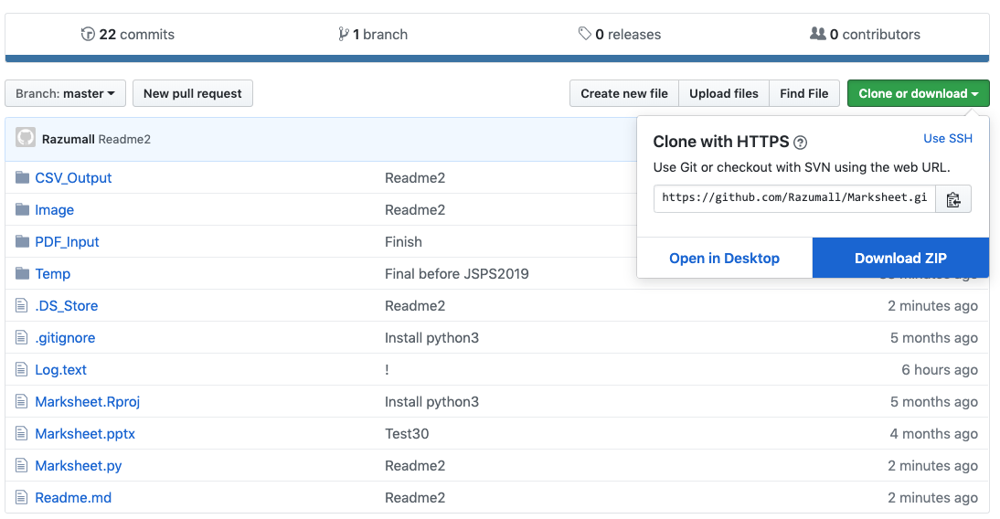

Name
====

直腸肛門奇形研究会が推奨する臨床的排便機能評価スコアを、自作マークシートを使って、臨床情報を集計しデータ化するシステムを開発しました。


# Requirement
* macOS (Mojave推奨)
* Python 2.7+: 現在3系に移行中

## インストールが不要なライブラリ (標準ライブラリ)
* os: OSに依存した機能を使うためのライブラリ
* datetime: 時間に関するデータを取り扱うためのライブラリ
* shutil: ファイルのバッチ処理のためのライブラリ

## Terminalからインストールするライブラリ
* OpenCV: 画像処理やパターン認識などを行う
* pdf2image: マークシートをスキャンしたPDFをPNGに変換する
* PyPDF2: 複数のPDFファイルを連結して1つにする
* Pandas: データ解析を支援する機能
* Numpy: 数値計算のためのモジュール

もしPython初心者の方でつまずくことがあった場合は、下記の記事を参考にしてもらえるといいかもしれません。

[Python初心者がnumpyとOpenCVをインストールするためにしたこと](https://www.pediatricsurgery.site/entry/2018/12/24/130442)

`pip`がインストールされていない場合は`pip`をインストールしてください。  

[Pythonのパッケージ管理システムpipの使い方](https://note.nkmk.me/python-pip-usage/)

```bash
# OpenCV
pip install opencv-python

# pdf2image
pip install pdf2image --user

# PyPDF2
pip install pypdf2

# pandas
pip install pandas

# Numpy
pip install numpy
```

## Marksheet
マークシートは`Marksheet.pptx`を印刷してください。印刷する紙は、書きやすさや消しゴムを使った時の消え方などを考えると、上質紙の方が良いと思われます。下記のコピー用紙がちょうどいい塩梅かと思いました。

[コクヨ コピー用紙 A4 スーパーファイングレード 厚紙用紙 50枚 インクジェットプリンタ用紙 KJ-M15A4-50](https://www.amazon.co.jp/gp/product/B002U48XC6/ref=ppx_yo_dt_b_search_asin_title?ie=UTF8&psc=1)

# Install
このレポジトリの右上にある`Clone or download`のタブをクリックして`Download ZIP`を選択してZIPファイルをダウンロードしてください。GitHubを使える方は、このレポジトリを`clone`してもらえればと思います。  


# Usage


# Licence

[MIT](https://github.com/tcnksm/tool/blob/master/LICENCE)

# Author
[tcnksm](https://github.com/tcnksm)

# Recommendation
Python初心者の方で、インストールやプログラムの内容などの理解が足りない方は下記のブログ記事が役に立つかもしれません。
* [PythonとOpenCVで簡易OMR（マークシートリーダ）を作る](https://qiita.com/sbtseiji/items/6438ec2bf970d63817b8)
* [Python初心者がnumpyとOpenCVをインストールするためにしたこと](https://www.pediatricsurgery.site/entry/2018/12/24/130442)
* [【PythonとOpenCVで簡易OMR(マークシートリーダ)を作る】を初心者が理解するために①](https://www.pediatricsurgery.site/entry/2018/12/24/154519)
* [【PythonとOpenCVで簡易OMR(マークシートリーダ)を作る】を初心者が理解するために②
Python](https://www.pediatricsurgery.site/entry/2018/12/25/231014)
* [【PythonとOpenCVで簡易OMR(マークシートリーダ)を作る】を初心者が理解するために③](https://www.pediatricsurgery.site/entry/2018/12/29/195859)

# Acknowledgments

# Update
* Python 3系への移行
* ERRORをcsvに加えられるようにする
* DateとIDそれぞれで
* Area_sumが閾値以下しかない->unmarked
* Area_sumが大きいものが2つ->max*0.9->duplication?